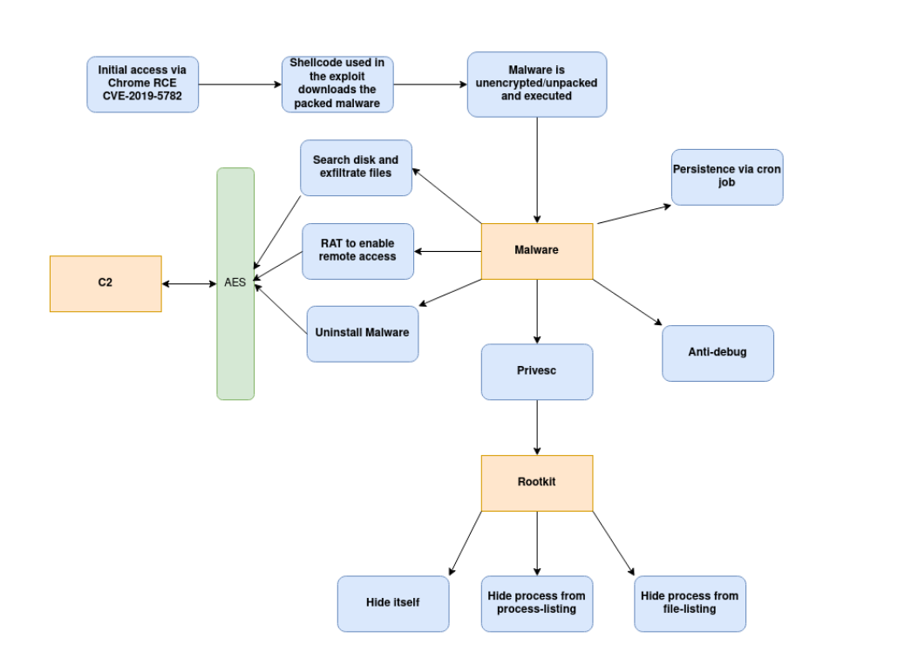

# cyber_attack_simulation
Attack simulation involving rce &amp; kernel lpe exploits and malware + rootkit to exfil data

This project demonstrates how a malicious attacker can chain together multiple adversary tactics and
techniques to completely take over a system.

#### Features
* Initial RCE via CVE-2019-5782 (Chrome JIT compiler bug)
* RCE automatically executes a small dropper stub that pulls down and executes malware
* This malware was packed/encrypted using RC4 as an anti-re feature, and begins by unpacking itself
* It sets up persistence, does some anti-debug checks, and privesc's using non-standard suid
  binaries found on the target system
* Once root privileges are obtained a custom rootkit is loaded which completely hides the malware
  from both process listings and the filesystem
* Finally for the actual functionality, the malware communicates with a C2 to receive and execute
  commands
* The attack was supposed to mimick the recent Korean apt targeting security researchers, so one of
  the supported features is to search the disk for all files of a specific format, and exfiltrating
  them to the C2. 
* Another feature that it supports is a remote access trojan to allow manual access to thet arget,
  and the ability to be completely wiped from the system via an 'uninstall' command from the C2.




#### Demo Setup Instructions
```sh
# Install dependencies
sudo apt install python3-pip3 python-pip git
git clone https://github.com/seal9055/cyber_attack_simulation && cd cyber_attack_simulation
pip3 install -r requirements.txt
echo "export PATH=$PATH:$HOME/.local/bin/" >> ~/.bashrc

# Spawn C2
python3 C2/src/main.py
Open a webbrowser and navigate to '127.0.0.1:5000/cmd'

# Compile malware
cd malware/src
make build
cd ../..

# Compile rootkit
cd rootkit
./build.sh rootkit
cd ..

# Use Crypter to encrypt the malware
./crypter/bin/crypter malware/src/dist/malware malware.bin

# Setup directory structure for C2
cp rootkit/rootkit.ko C2/src/static
cp ./cryper/bin/malware.bin C2/src/static

# Setup vulnerable suid binary
sudo chown root ./dash
sudo chmod u+s ./dash

# Build vulnerable chrome-v8 version
git clone https://chromium.googlesource.com/chromium/tools/depot_tools.git
echo "export PATH=/opt/depot_tools:$PATH" >> ~/.bashrc
gclient sync
fetch V8
cd V8
git reset --hard b474b3102bd4a95eafcdb68e0e44656046132bc9
gclient
tools/dev/v8gen.py x64.release
ninja -C ./out.gn/x64.release d8

# Start exploit/malware
python3 C2/src/main.py
./V8/out.gn/x64.release/v8 ./dropper/exploit.js

# Access C2 at localhost:5000
```
